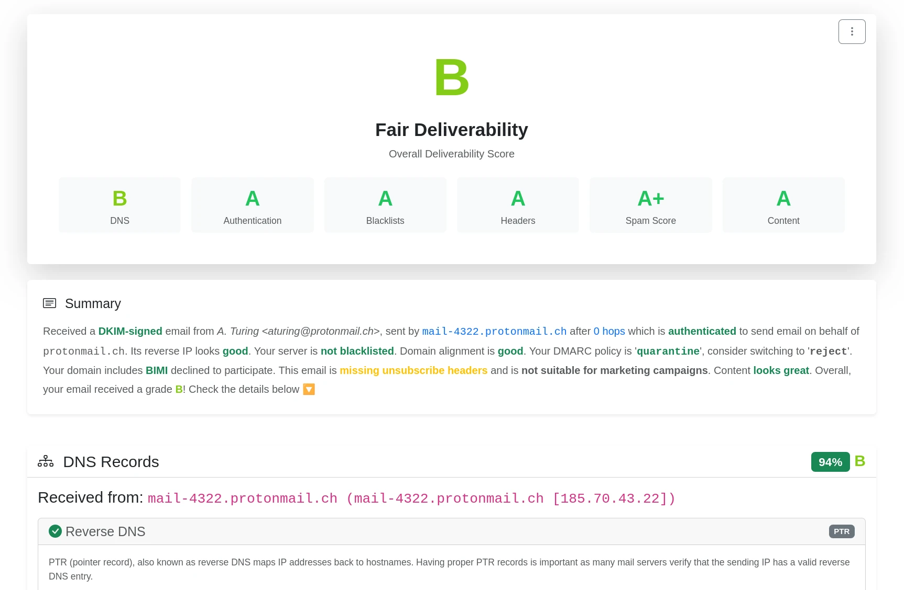

# happyDeliver - Email Deliverability Tester


An open-source email deliverability testing platform that analyzes test emails and provides detailed deliverability reports with scoring.

## Features

- **Complete Email Analysis**: Analyzes SPF, DKIM, DMARC, BIMI, ARC, SpamAssassin and rspamd scores, DNS records, blacklist status, content quality, and more
- **REST API**: Full-featured API for creating tests and retrieving reports
- **LMTP Server**: Built-in LMTP server for seamless MTA integration
- **Scoring System**: Gives A to F grades and scoring with weighted factors across dns, authentication, spam, blacklists, content, and headers
- **Database Storage**: SQLite or PostgreSQL support
- **Configurable**: via environment or config file for all settings



## Quick Start

### With Docker (Recommended)

The easiest way to run happyDeliver is using the all-in-one Docker container that includes Postfix, authentication_milter, SpamAssassin, and the happyDeliver application.

#### What's included in the Docker container:

- **Postfix MTA**: Receives emails on port 25
- **authentication_milter**: Entreprise grade email authentication
- **SpamAssassin**: Spam scoring and analysis
- **rspamd**: Second spam filter for cross-validated scoring
- **happyDeliver API**: REST API server on port 8080
- **SQLite Database**: Persistent storage for tests and reports

#### 1. Using docker-compose

```bash
# Clone the repository
git clone https://git.nemunai.re/happyDomain/happyDeliver.git
cd happydeliver

# Edit docker-compose.yml to set your domain
# Change HAPPYDELIVER_DOMAIN environment variable and hostname

# Build and start
docker-compose up -d

# View logs
docker-compose logs -f

# Stop
docker-compose down
```

The API will be available at `http://localhost:8080` and SMTP at `localhost:25`.

#### 2. Using docker build directly

```bash
# Build the image
docker build -t happydeliver:latest .

# Run the container
docker run -d \
  --name happydeliver \
  -p 25:25 \
  -p 8080:8080 \
  -e HAPPYDELIVER_DOMAIN=yourdomain.com \
  --hostname mail.yourdomain.com \
  -v $(pwd)/data:/var/lib/happydeliver \
  -v $(pwd)/logs:/var/log/happydeliver \
  happydeliver:latest
```

#### 3. Configure TLS Certificates (Optional but Recommended)

To enable TLS encryption for incoming SMTP connections, you can configure Postfix to use your SSL/TLS certificates. This is highly recommended for production deployments.

##### Using docker-compose

Add the certificate paths to your `docker-compose.yml`:

```yaml
environment:
  - POSTFIX_CERT_FILE=/etc/ssl/certs/mail.yourdomain.com.crt
  - POSTFIX_KEY_FILE=/etc/ssl/private/mail.yourdomain.com.key
volumes:
  - /path/to/your/certificate.crt:/etc/ssl/certs/mail.yourdomain.com.crt:ro
  - /path/to/your/private.key:/etc/ssl/private/mail.yourdomain.com.key:ro
```

##### Using docker run

```bash
docker run -d \
  --name happydeliver \
  -p 25:25 \
  -p 8080:8080 \
  -e HAPPYDELIVER_DOMAIN=yourdomain.com \
  -e POSTFIX_CERT_FILE=/etc/ssl/certs/mail.yourdomain.com.crt \
  -e POSTFIX_KEY_FILE=/etc/ssl/private/mail.yourdomain.com.key \
  --hostname mail.yourdomain.com \
  -v /path/to/your/certificate.crt:/etc/ssl/certs/mail.yourdomain.com.crt:ro \
  -v /path/to/your/private.key:/etc/ssl/private/mail.yourdomain.com.key:ro \
  -v $(pwd)/data:/var/lib/happydeliver \
  -v $(pwd)/logs:/var/log/happydeliver \
  happydeliver:latest
```

**Notes:**
- The certificate file should contain the full certificate chain (certificate + intermediate CAs)
- The private key file must be readable by the postfix user inside the container
- TLS is configured with `smtpd_tls_security_level = may`, which means it's opportunistic (STARTTLS supported but not required)
- If both environment variables are not set, Postfix will run without TLS support

#### 4. Configure Network and DNS

##### Open SMTP Port

Port 25 (SMTP) must be accessible from the internet to receive test emails:

```bash
# Check if port 25 is listening
netstat -ln | grep :25

# Allow port 25 through firewall (example with ufw)
sudo ufw allow 25/tcp

# For iptables
sudo iptables -A INPUT -p tcp --dport 25 -j ACCEPT
```

**Note:** Many ISPs and cloud providers block port 25 by default to prevent spam. You may need to request port 25 to be unblocked through your provider's support.

##### Configure DNS Records

Point your domain to the server's IP address.

```
yourdomain.com.  IN  A     203.0.113.10
yourdomain.com.  IN  AAAA  2001:db8::10
```

Replace `yourdomain.com` with the value you set for `HAPPYDELIVER_DOMAIN` and IPs accordingly.

There is no need for an MX record here since the same host will serve both HTTP and SMTP.


### Manual Build

#### 1. Build

```bash
go generate
go build -o happyDeliver ./cmd/happyDeliver
```

### 2. Run the API Server

```bash
./happyDeliver server
```

The server will start on `http://localhost:8080` by default.

#### 3. Integrate with your existing e-mail setup

It is expected your setup annotate the email with eg. opendkim, spamassassin, rspamd, ...
happyDeliver will not perform thoses checks, it relies instead on standard software to have real world annotations.

Choose one of the following way to integrate happyDeliver in your existing setup:

#### Postfix LMTP Transport

You'll obtain the best results with a custom [transport rule](https://www.postfix.org/transport.5.html) using LMTP.

1. Start the happyDeliver server with LMTP enabled (default listens on `127.0.0.1:2525`):

  ```bash
  ./happyDeliver server
  ```

  You can customize the LMTP address with the `-lmtp-addr` flag or in the config file.

2. Create the file `/etc/postfix/transport_happydeliver` with the following content:

  ```
  # Transport map - route test emails to happyDeliver LMTP server
  # Pattern: test-<base32-uuid>@yourdomain.com -> LMTP on localhost:2525

  /^test-[a-zA-Z2-7-]{26,30}@yourdomain\.com$/  lmtp:inet:127.0.0.1:2525
  ```

3. Append the created file to `transport_maps` in your `main.cf`:

  ```diff
  -transport_maps = texthash:/etc/postfix/transport
  +transport_maps = texthash:/etc/postfix/transport, pcre:/etc/postfix/transport_happydeliver
  ```

  If your `transport_maps` option is not set, just append this line:

  ```
  transport_maps = pcre:/etc/postfix/transport_happydeliver
  ```

  Note: to use the `pcre:` type, you need to have `postfix-pcre` installed.

4. Reload Postfix configuration:

  ```bash
  postfix reload
  ```

#### 4. Create a Test

```bash
curl -X POST http://localhost:8080/api/test
```

Response:
```json
{
  "id": "550e8400-e29b-41d4-a716-446655440000",
  "email": "test-kfauqaao-ukj2if3n-fgrfkiafaa@localhost",
  "status": "pending",
  "message": "Send your test email to the address above"
}
```

#### 5. Send Test Email

Send a test email to the address provided (you'll need to configure your MTA to route emails to the analyzer - see MTA Integration below).

#### 6. Get Report

```bash
curl http://localhost:8080/api/report/550e8400-e29b-41d4-a716-446655440000
```

## API Endpoints

| Endpoint | Method | Description |
|----------|--------|-------------|
| `/api/test` | POST | Create a new deliverability test |
| `/api/test/{id}` | GET | Get test metadata and status |
| `/api/report/{id}` | GET | Get detailed analysis report |
| `/api/report/{id}/raw` | GET | Get raw annotated email |
| `/api/status` | GET | Service health and status |

## Email Analyzer (CLI Mode)

For manual testing or debugging, you can analyze emails from the command line:

```bash
cat email.eml | ./happyDeliver analyze
```

Or specify recipient explicitly:

```bash
cat email.eml | ./happyDeliver analyze -recipient test-uuid@yourdomain.com
```

**Note:** In production, emails are delivered via LMTP (see integration instructions above).

## Scoring System

The deliverability score is calculated from A to F based on:

- **DNS**: Step-by-step analysis of PTR, Forward-Confirmed Reverse DNS, MX, SPF, DKIM, DMARC and BIMI records
- **Authentication**: IPRev, SPF, DKIM, DMARC, BIMI and ARC validation
- **Blacklist**: RBL/DNSBL checks
- **Headers**: Required headers, MIME structure, Domain alignment
- **Spam**: SpamAssassin and rspamd scores (combined 50/50)
- **Content**: HTML quality, links, images, unsubscribe

## Funding

This project is funded through [NGI Zero Core](https://nlnet.nl/core), a fund established by [NLnet](https://nlnet.nl) with financial support from the European Commission's [Next Generation Internet](https://ngi.eu) program. Learn more at the [NLnet project page](https://nlnet.nl/project/happyDomain).

[](https://nlnet.nl)
[](https://nlnet.nl/core)

## License

GNU Affero General Public License v3.0 or later (AGPL-3.0-or-later)
