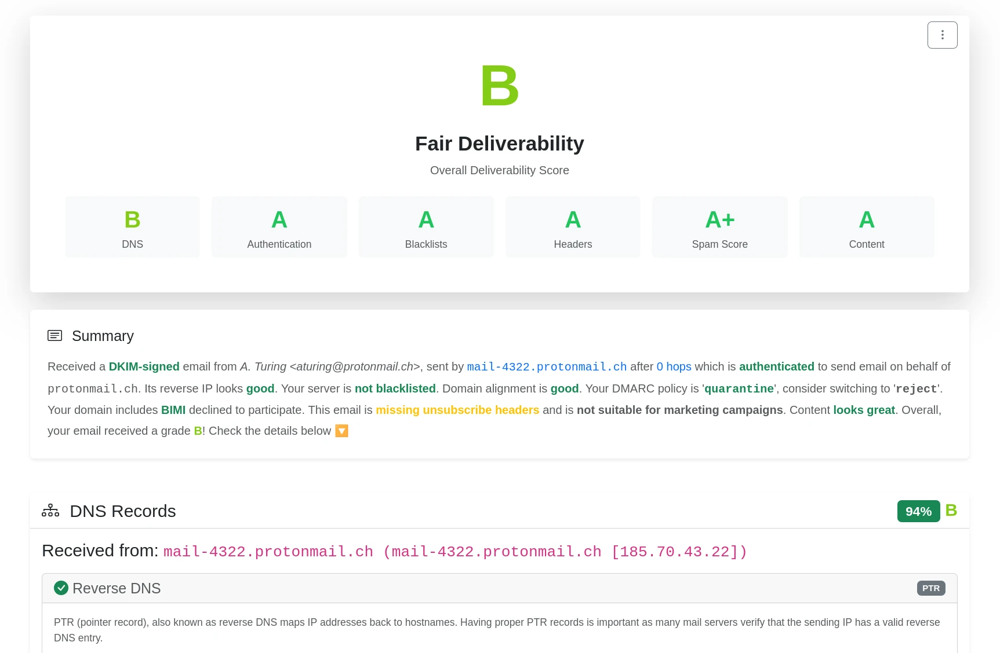

# happyDeliver - Email Deliverability Tester


An open-source email deliverability testing platform that analyzes test emails and provides detailed deliverability reports with scoring.

## Features

- **Complete Email Analysis**: Analyzes SPF, DKIM, DMARC, BIMI, ARC, SpamAssassin and rspamd scores, DNS records, blacklist status, content quality, and more
- **REST API**: Full-featured API for creating tests and retrieving reports
- **LMTP Server**: Built-in LMTP server for seamless MTA integration
- **Scoring System**: Gives A to F grades and scoring with weighted factors across dns, authentication, spam, blacklists, content, and headers
- **Database Storage**: SQLite or PostgreSQL support
- **Configurable**: via environment or config file for all settings



## Quick Start

### With Docker (Recommended)

The easiest way to run happyDeliver is using the all-in-one Docker container that includes Postfix, authentication_milter, SpamAssassin, and the happyDeliver application.

#### What's included in the Docker container:

- **Postfix MTA**: Receives emails on port 25
- **authentication_milter**: Entreprise grade email authentication
- **SpamAssassin**: Spam scoring and analysis
- **rspamd**: Second spam filter for cross-validated scoring
- **happyDeliver API**: REST API server on port 8080
- **SQLite Database**: Persistent storage for tests and reports

#### 1. Using docker-compose

```bash
# Clone the repository
git clone https://git.nemunai.re/happyDomain/happyDeliver.git
cd happydeliver

# Edit docker-compose.yml to set your domain
# Change HAPPYDELIVER_DOMAIN environment variable and hostname

# Build and start
docker-compose up -d

# View logs
docker-compose logs -f

# Stop
docker-compose down
```

The API will be available at `http://localhost:8080` and SMTP at `localhost:25`.

#### 2. Using docker build directly

```bash
# Build the image
docker build -t happydeliver:latest .

# Run the container
docker run -d \
  --name happydeliver \
  -p 25:25 \
  -p 8080:8080 \
  -e HAPPYDELIVER_DOMAIN=yourdomain.com \
  --hostname mail.yourdomain.com \
  -v $(pwd)/data:/var/lib/happydeliver \
  -v $(pwd)/logs:/var/log/happydeliver \
  happydeliver:latest
```

#### 3. Configure TLS Certificates (Optional but Recommended)

To enable TLS encryption for incoming SMTP connections, you can configure Postfix to use your SSL/TLS certificates. This is highly recommended for production deployments.

##### Using docker-compose

Add the certificate paths to your `docker-compose.yml`:

```yaml
environment:
  - POSTFIX_CERT_FILE=/etc/ssl/certs/mail.yourdomain.com.crt
  - POSTFIX_KEY_FILE=/etc/ssl/private/mail.yourdomain.com.key
volumes:
  - /path/to/your/certificate.crt:/etc/ssl/certs/mail.yourdomain.com.crt:ro
  - /path/to/your/private.key:/etc/ssl/private/mail.yourdomain.com.key:ro
```

##### Using docker run

```bash
docker run -d \
  --name happydeliver \
  -p 25:25 \
  -p 8080:8080 \
  -e HAPPYDELIVER_DOMAIN=yourdomain.com \
  -e POSTFIX_CERT_FILE=/etc/ssl/certs/mail.yourdomain.com.crt \
  -e POSTFIX_KEY_FILE=/etc/ssl/private/mail.yourdomain.com.key \
  --hostname mail.yourdomain.com \
  -v /path/to/your/certificate.crt:/etc/ssl/certs/mail.yourdomain.com.crt:ro \
  -v /path/to/your/private.key:/etc/ssl/private/mail.yourdomain.com.key:ro \
  -v $(pwd)/data:/var/lib/happydeliver \
  -v $(pwd)/logs:/var/log/happydeliver \
  happydeliver:latest
```

**Notes:**
- The certificate file should contain the full certificate chain (certificate + intermediate CAs)
- The private key file must be readable by the postfix user inside the container
- TLS is configured with `smtpd_tls_security_level = may`, which means it's opportunistic (STARTTLS supported but not required)
- If both environment variables are not set, Postfix will run without TLS support

#### 4. Configure Network and DNS

##### Open SMTP Port

Port 25 (SMTP) must be accessible from the internet to receive test emails:

```bash
# Check if port 25 is listening
netstat -ln | grep :25

# Allow port 25 through firewall (example with ufw)
sudo ufw allow 25/tcp

# For iptables
sudo iptables -A INPUT -p tcp --dport 25 -j ACCEPT
```

**Note:** Many ISPs and cloud providers block port 25 by default to prevent spam. You may need to request port 25 to be unblocked through your provider's support.

##### Configure DNS Records

Point your domain to the server's IP address.

```
yourdomain.com.  IN  A     203.0.113.10
yourdomain.com.  IN  AAAA  2001:db8::10
```

Replace `yourdomain.com` with the value you set for `HAPPYDELIVER_DOMAIN` and IPs accordingly.

There is no need for an MX record here since the same host will serve both HTTP and SMTP.

##### Running behind an MTA that already owns port 25

If the host already runs its own MTA on port 25, the simplest option is to give the container a
dedicated address, so that nothing has to be shared:

```yaml
    ports:
      - "203.0.113.9:25:25"
```

When that is not possible, the container can sit **behind** your MTA. The catch is that
`authentication_milter` derives SPF, IPRev, PTR and DMARC from the *connection* (client IP,
HELO, MAIL FROM), not from the `Received:` headers: relaying the message naively would make
every one of those verdicts describe your own MTA instead of the sender under test. Rewriting
headers would not help — the connection has to be restated, which is what Postfix's `XCLIENT`
command does.

Your Postfix knows how to send `XFORWARD` (which only fixes logging) but not `XCLIENT` (which
also fixes what the milters see), so happyDeliver ships a small relay that translates one into
the other:

```
Internet :25 → your Postfix  ──XFORWARD──→  happyDeliver relay :10025
                                    ──XCLIENT──→  bundled Postfix → milters → analysis
```

1. Enable the relay on the container, and publish port 10025 instead of 25:

  ```yaml
    environment:
      HAPPYDELIVER_RELAY_ADDR: ":10025"
      # Address(es) your MTA connects from. Anyone listed here can restate the
      # client identity, and therefore forge an "spf=pass": keep it narrow.
      HAPPYDELIVER_RELAY_TRUSTED_NETS: "172.28.0.1"

    ports:
      - "10025:10025"
      - "8080:8080"
  ```

2. On the host MTA, accept the happyDeliver domain and route it to the relay over a **dedicated
   transport**, so that `XFORWARD` is only ever sent there:

  ```
  # main.cf
  relay_domains = $relay_domains, yourdomain.com
  transport_maps = texthash:/etc/postfix/transport_happydeliver
  ```

  ```
  # /etc/postfix/transport_happydeliver
  yourdomain.com    happydeliver:[127.0.0.1]:10025
  ```

  ```
  # master.cf
  happydeliver unix - - n - - smtp
    -o smtp_send_xforward_command=yes
    -o smtp_tls_security_level=none
    -o disable_dns_lookups=yes
  ```

3. Point the MX of `yourdomain.com` at that host, and reload Postfix.

A front-end that speaks `XCLIENT` natively (an nginx mail proxy, for instance) can talk to the
relay directly: its `XCLIENT` command is passed through untouched.

Two consequences worth knowing: the extra hop through your MTA legitimately shows up in the
`Received` chain of the reports, and if the bundled Postfix ever refuses the impersonation the
relay answers `421` rather than delivering a message whose authentication results would be
wrong.


### Manual Build

#### 1. Build

```bash
go generate
go build -o happyDeliver ./cmd/happyDeliver
```

### 2. Run the API Server

```bash
./happyDeliver server
```

The server will start on `http://localhost:8080` by default.

#### 3. Integrate with your existing e-mail setup

It is expected your setup annotate the email with eg. opendkim, spamassassin, rspamd, ...
happyDeliver will not perform thoses checks, it relies instead on standard software to have real world annotations.

#### Receiver Hostname

happyDeliver filters `Authentication-Results` headers by hostname to only trust headers added by your MTA (and not headers that may have been injected by the sender). By default, it uses the system hostname (`os.Hostname()`).

If your MTA's `authserv-id` (the hostname at the beginning of `Authentication-Results` headers) differs from the machine running happyDeliver, you must set it explicitly:

```bash
./happyDeliver server -receiver-hostname mail.example.com
```

Or via environment variable:
```bash
HAPPYDELIVER_RECEIVER_HOSTNAME=mail.example.com ./happyDeliver server
```

**How to find the correct value:** look at the `Authentication-Results` headers in a received email. They start with the authserv-id, e.g. `Authentication-Results: mail.example.com; spf=pass ...` — in this case, use `mail.example.com`.

If the value is misconfigured, happyDeliver will log a warning when the last `Received` hop doesn't match the expected hostname.

This setting only applies to messages delivered to happyDeliver. For an uploaded `.eml` file the authserv-id cannot be known in advance, so it is detected from the file itself: the topmost `Authentication-Results` header wins, as it was written by the last server that handled the message. Both the source and the authserv-id that was trusted are recorded in the report (`source`, `authserv_id`, `authserv_ids_found`).

#### Postfix LMTP Transport

You'll obtain the best results with a custom [transport rule](https://www.postfix.org/transport.5.html) using LMTP.

1. Start the happyDeliver server with LMTP enabled (default listens on `127.0.0.1:2525`):

  ```bash
  ./happyDeliver server
  ```

  You can customize the LMTP address with the `-lmtp-addr` flag or in the config file.

2. Create the file `/etc/postfix/transport_happydeliver` with the following content:

  ```
  # Transport map - route test emails to happyDeliver LMTP server
  # Pattern: test-<base32-uuid>@yourdomain.com -> LMTP on localhost:2525

  /^test-[a-zA-Z2-7-]{26,30}@yourdomain\.com$/  lmtp:inet:127.0.0.1:2525
  ```

3. Append the created file to `transport_maps` in your `main.cf`:

  ```diff
  -transport_maps = texthash:/etc/postfix/transport
  +transport_maps = texthash:/etc/postfix/transport, pcre:/etc/postfix/transport_happydeliver
  ```

  If your `transport_maps` option is not set, just append this line:

  ```
  transport_maps = pcre:/etc/postfix/transport_happydeliver
  ```

  Note: to use the `pcre:` type, you need to have `postfix-pcre` installed.

4. Reload Postfix configuration:

  ```bash
  postfix reload
  ```

#### 4. Create a Test

```bash
curl -X POST http://localhost:8080/api/test
```

Response:
```json
{
  "id": "550e8400-e29b-41d4-a716-446655440000",
  "email": "test-kfauqaao-ukj2if3n-fgrfkiafaa@localhost",
  "status": "pending",
  "message": "Send your test email to the address above"
}
```

#### 5. Send Test Email

Send a test email to the address provided (you'll need to configure your MTA to route emails to the analyzer - see MTA Integration below).

Alternatively, upload a message you already received elsewhere (no test address needed!), the report is produced immediately:

```bash
curl -F "file=@message.eml" http://localhost:8080/api/test/upload
```

Only what the file already carries can be reported: SPF, DKIM, DMARC, ARC, BIMI, reverse DNS, transport encryption and the spam filters' verdicts are all produced by the server that receives a message, so an uploaded file only has them if that server wrote them. The report records `"source": "uploaded"` so a missing verdict is not mistaken for a misconfiguration of your instance.

Two settings control this endpoint:

| Flag | Environment variable | Default | Description |
|------|----------------------|---------|-------------|
| `-disable-eml-upload` | `HAPPYDELIVER_DISABLE_EML_UPLOAD` | *enabled* | Turn the upload endpoint off (it also hides the widget in the web UI) |
| `-max-upload-size` | `HAPPYDELIVER_MAX_UPLOAD_SIZE` | `10485760` (10 MiB) | Maximum size in bytes of an uploaded file |

Note that an uploaded message is stored and listed like any other report; disable the upload endpoint, or the public listing with `-disable-test-list`, if that does not suit your instance.

#### 6. Get Report

```bash
curl http://localhost:8080/api/report/550e8400-e29b-41d4-a716-446655440000
```

## API Endpoints

| Endpoint | Method | Description |
|----------|--------|-------------|
| `/api/test` | POST | Create a new deliverability test |
| `/api/test/upload` | POST | Analyze an uploaded `.eml` file (multipart, field `file`) |
| `/api/test/{id}` | GET | Get test metadata and status |
| `/api/report/{id}` | GET | Get detailed analysis report |
| `/api/report/{id}/raw` | GET | Get raw annotated email |
| `/api/status` | GET | Service health and status |

## Email Analyzer (CLI Mode)

For manual testing or debugging, you can analyze emails from the command line:

```bash
cat email.eml | ./happyDeliver analyze
```

Or specify recipient explicitly:

```bash
cat email.eml | ./happyDeliver analyze -recipient test-uuid@yourdomain.com
```

For a message received by *another* server (an archive, a mail from your inbox), add `-eml` so the authserv-id is taken from the file instead of `-receiver-hostname`:

```bash
cat inbox-message.eml | ./happyDeliver analyze -eml -json
```

**Note:** In production, emails are delivered via LMTP (see integration instructions above).

## Use with happyDomain

happyDeliver can be driven by [happyDomain](https://happydomain.org) through
the [`checker-happydeliver`](https://git.nemunai.re/happyDomain/checker-happydeliver)
plugin, so the deliverability of a domain you manage is monitored alongside
its DNS and inbound SMTP posture.

How it works:

1. Attach the **Outbound deliverability** checker to the mail service of a zone
   in happyDomain. Point it at a happyDeliver instance via `happydeliver_url`;
   operators can configure a default instance globally.
2. On each run, the checker calls `POST /api/test` to allocate a fresh
   recipient address, prompts the user (or an automated sender) to mail it from
   the tested domain, then polls `GET /api/test/{id}` until the report is
   ready.
3. The structured report from `GET /api/report/{id}` is translated into
   happyDomain rule states: CRIT/WARN/INFO on SPF, DKIM, DMARC, alignment, spam
   score, blacklists and headers, plus an overall score threshold
   (`min_score`/`warn_score`).
4. Runs repeat on a configurable interval so a regression in deliverability (a
   new RBL listing, a DKIM key rotation gone wrong, a broken SPF include, ...)
   surfaces as a domain-level alert in happyDomain.

See the [`checker-happydeliver` repository](https://git.nemunai.re/happyDomain/checker-happydeliver)
for build instructions and the full list of run options.

## Scoring System

The deliverability score is calculated from A to F based on:

- **DNS**: Step-by-step analysis of PTR, Forward-Confirmed Reverse DNS, MX, SPF, DKIM, DMARC and BIMI records
- **Authentication**: IPRev, SPF, DKIM, DMARC, BIMI and ARC validation
- **Blacklist**: RBL/DNSBL checks
- **Headers**: Required headers, MIME structure, Domain alignment
- **Spam**: SpamAssassin and rspamd scores (combined 50/50)
- **Content**: HTML quality, links, images, unsubscribe

## Funding

This project is funded through [NGI Zero Core](https://nlnet.nl/core), a fund established by [NLnet](https://nlnet.nl) with financial support from the European Commission's [Next Generation Internet](https://ngi.eu) program. Learn more at the [NLnet project page](https://nlnet.nl/project/happyDomain).

[](https://nlnet.nl)
[](https://nlnet.nl/core)

## License

GNU Affero General Public License v3.0 or later (AGPL-3.0-or-later)
